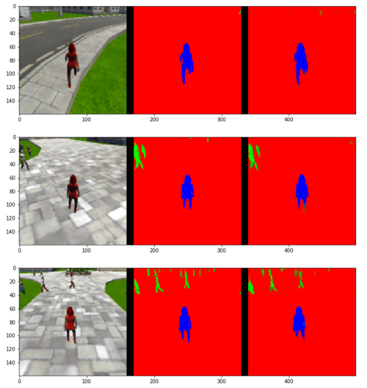
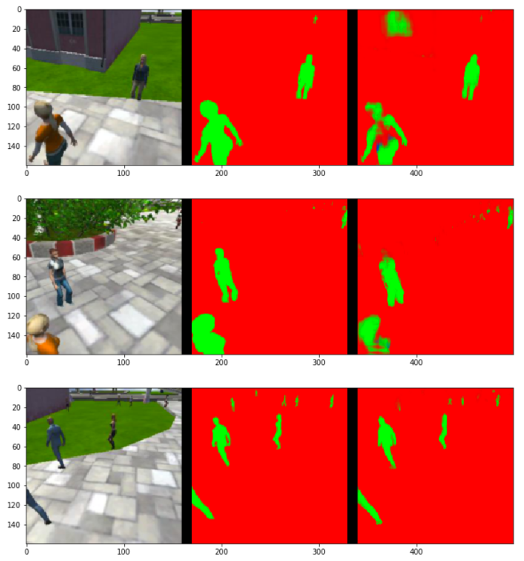

## Project: Follow me

The challenge is to train a deep neural network to identify and track a target in a drone simulation, only using inputs from a camera image. The problem is essentially a semantic segmentation task, where each pixel in the input image should be assigned to a semantic class, in this case, 3 classes: the target, other humans, and the background.

### The neural network architecture

Below is an explanation of each layer of the network architecture and the role that it plays in the overall network. I have experimented with two different network architectures differing in depth, one with 4 encoder/decoder blocks, and another with only 2 encoder/decoder blocks.

#### Fully Convolutional Neural Networks

Fully Convolutional Neural Networks (FCNs) were designed to solve semantic segmentation tasks. The convolutional layers obey translation invariance because the output depends only on the local area of input. This is advantageous, because spatial information is preserved, and the input image can be of any size.

The network architecture consists of a number of encoder layers with separable convolutions and batch normalization, an 1x1 convolution to learn segments preserving spatial information, and decoder layers with bilinear upsampling and skip layers to relevant encoder layers.

*Note:* If the task was classification rather than segmentation, instead of the 1x1 convolution and upsampling, fully connected layers could be used. A fully connected layer connects every output of the previous layer (representing higher level features) to each of `n` outputs of the fully connected layer. The output of the fully connected layer corresponds to the probability of each class the object might belong to.

#### Encoder layers

The encoder part is a convolution network that reduces to a deeper 1x1 convolution layer. Separable convolutions comprise of a convolution performed over each channel of an input layer and followed by a 1x1 convolution that takes the output channels from the previous step and then combines them into an output layer.

Compared to regular convolution, separable convolutions have less parameters, which improves runtime performance. Less parameters in general also help with overfitting thus makes the model more efficient.

Each encoder layer is defined using the function:

```python
def encoder_block(input_layer, filters, strides):
    return separable_conv2d_batchnorm(input_layer, filters, strides)
```

#### Middle layer

The middle layer is a 1x1 convolutional layer with a kernel size of 1 and a stride of 1.

The middle layer is defined with the following line, where `enc_n` is the last encoder layer:

```python
con1 = conv2d_batchnorm(enc_n, num_filters, kernel_size=1, strides=1)
```

#### Decoder layers

Decoder layers are applied to downsampled predictions to upsample them and get predictions for the whole input image. We use bilinear upsampling, which is a resampling technique that uses the weighted average of four nearest known pixels, located diagonally to a given pixel, to estimate a new pixel intensity value.

Each decoder layer is defined using the following function:

```python
def decoder_block(small_ip_layer, large_ip_layer, filters):
    # Upsample the small input layer
    small_in_upsampled = bilinear_upsample(small_ip_layer)
    # Concatenate the upsampled and large input layers
    output_layer = layers.concatenate([small_in_upsampled, large_ip_layer])
    # Add some number of separable convolution layers
    output_layer = separable_conv2d_batchnorm(output_layer, filters)
    output_layer = separable_conv2d_batchnorm(output_layer, filters)
    return output_layer
```

*Skip connections* are introduced between the encoder layer and the decoder layer to improve the resolution of the results. These skip layers add more information to the decoder networks after the upsampling operation, which in itself has only reduced information about original picture. Skip layers enable the network to learn finer details of the shapes in the training data.

#### Batch normalization

Batch normalization works by normalizing the inputs to each layer within the network. During training, we normalize each layer's inputs by using the mean and variance of the values in the current mini-batch. The advantages of such an approach are: faster convergence (forward passes are slower, but faster convergence results in a net overall speedup), allows higher learning rates,
simplifies the creation of deeper networks, and it also provides regularization, which helps with overfitting.

Batch normalization is achieved by:
```
output_layer = layers.BatchNormalization()(output_layer)
```

#### Sources

* [Fully Convolutional Networks for Semantic Segmentation, Long et al. 2015](https://arxiv.org/abs/1411.4038)
* [Semantic segmentation over the years](https://meetshah1995.github.io/semantic-segmentation/deep-learning/pytorch/visdom/2017/06/01/semantic-segmentation-over-the-years.html)

#### Architectures

I tried two different FCNs to solve the "Follow Me" task, one with 4 encoder/decoder blocks, and another with only 2 encoder/decoder blocks.

Initially, I expected the deeper network to perform better, however it turned out that actually the smaller network with 2 encoder/decoder blocks outperforms the deeper network with the parameters and data I provided. (See results below.) One reason for that might be, that the dataset is not particularly big and the deeper network has more weights and is more prone to overfitting.

#### Network 1 (FCN-2)

```python
def fcn_model_2(inputs, num_classes):   
    # Add Encoder Blocks.
    enc1 = encoder_block(inputs, 16, strides=2);
    enc2 = encoder_block(enc1, 64, strides=2)
    # Add 1x1 Convolution layer
    con1 = conv2d_batchnorm(enc2, filters=256, kernel_size=1, strides=1)
    # Add the same number of Decoder Blocks as the number of Encoder Blocks
    dec1 = decoder_block(con1, enc1, 64)
    x = decoder_block(dec1, inputs, 16)

    print_network(inputs, enc1, enc2, con1, dec1, x)

    # The function returns the output layer of your model.
    return layers.Conv2D(num_classes, 3, activation='softmax', padding='same')(x)
```

The layers have the following dimensions:
```
input: (160, 160,   3)
enc1:  ( 80,  80,  16)
enc2:  ( 40,  40,  64)
con1:  ( 40,  40, 256)
dec1:  ( 80,  80,  64)
x:     (160, 160,  16)
```


#### Network 2 (FCN-4)

```python
def fcn_model_4(inputs, num_classes):   
    # Add Encoder Blocks.
    # Remember that with each encoder layer, the depth of your model (the number of filters) increases.
    enc1 = encoder_block(inputs, 16, strides=2);
    enc2 = encoder_block(enc1, 32, strides=2)
    enc3 = encoder_block(enc2, 64, strides=2)
    enc4 = encoder_block(enc3, 128, strides=2)
    # Add 1x1 Convolution layer
    con1 = conv2d_batchnorm(enc4, filters=1024, kernel_size=1, strides=1)
    # Add the same number of Decoder Blocks as the number of Encoder Blocks
    dec3 = decoder_block(con1, enc3, 128)
    dec2 = decoder_block(dec3, enc2, 64)
    dec1 = decoder_block(dec2, enc1, 32)
    x = decoder_block(dec1, inputs, 16)

    print_network(inputs, enc1, enc2, enc3, enc4, con1, dec3, dec2, dec1, x)

    # The function returns the output layer of your model.
    return layers.Conv2D(num_classes, 3, activation='softmax', padding='same')(x)
```

The layers have the following dimensions:
```
input: (160, 160,    3)
enc1:  ( 80,  80,   16)
enc2:  ( 40,  40,   32)
enc3:  ( 20,  20,   64)
enc4:  ( 10,  10,  128)
con1:  ( 10,  10, 1024)
dec1:  ( 20,  20,  128)
dec2:  ( 40,  40,   64)
dec3:  ( 80,  80,   32)
x:     (160, 160,   16)
```


### Training the model

#### Stochastic Gradient Descent

[Stochastic gradient descent](http://ruder.io/optimizing-gradient-descent/) is similar to gradient descent in that it is also an iterative method for minimizing an objective function. The difference is, that stochastic gradient descent uses an estimate of the gradient by using a different random sample of the dataset in each step. I used the Adaptive Moment Estimation ([ADAM](https://arxiv.org/abs/1412.6980v8)) algorithm, which computes adaptive learning rates for each parameter. ADAM has the following parameters:

| Name | Description | Default value |
|---|---|---|
|&alpha;| learning rate | 0.001 |
|&beta;<sub>1</sub>, &beta;<sub>2</sub>| exponential decay rates for the moment estimates | &beta;<sub>1</sub> = 0.9, &beta;<sub>2</sub> = 0.999 |
|&epsilon;| fuzz factor | 10<sup>-8</sup> |

I left the parameters at the recommended values, except for the learning rate (see parameter tuning below).

#### Hyper-parameters

* *Learning rate:* the learning rate influences the convergence properties of the training algorithm. Common issues are slow convergence, getting stuck on a local minima, when the learning rate is too small, and instabilities, when the learning rate is too high. ADAM uses adaptive learning rate decay, that is, the learning rate decreases exponentially as the learning progresses.

* *Number of epochs:* one epoch is one forward/backward pass of the entire training dataset. After many epochs, the gains in accuracy are diminishing, and also a too large value may lead to overfitting. However, a too small value may lead to underfitting.

* *Batch size:* the number of training samples in one forward/backward pass. The input is randomly shuffled an then put into the batches. The higher the batch size, the more memory is needed.

* *Steps per epoch:* to use all training data available, steps per epoch should be the size of the training dataset divided by batch size. However, it is not necessary to use all training data, so the number of steps can be slightly less. This also helps with overfitting.

* *Validation steps per epoch:* same as the steps per epoch, but for validation images.

* *Number of workers:* the number of parallel threads used to train the model. A [p2.xlarge](https://aws.amazon.com/ec2/instance-types/p2/) instance on the AWS has 1 GPU and 4 CPUs. The computation is mostly done on the GPU, so a value `>1` one will not increase performance.

#### Parameter tuning

Brute force tuning was used by experimenting with different parameter values and picking the best performing setup.

The ranges I tried for the different parameters are:
* Learning rate: `0.002` .. `0.007`
* Batch size: `20` .. `40`
* Steps per epoch: `100` .. `200`
* Validation steps: `30` .. `60`
* Number of epochs: `20` .. `50`

#### Scoring

The validation dataset covers three scenarios:
* Drone is following the hero
* Drone is on patrol and the hero is not visible
* Drone sees the hero from far away

For each scenario, the average intersection over union (IOU) is calculated for the hero and other people. A prefect prediction means an IOU of 1.0.

For the final IOU, only images where the hero is visible is counted. For the final score, the final IOU is decreased if the detection resulted in false positives or false negatives. Technically, if more then 3 pixels have probability greater then 0.5 of being the target person then this counts as the network guessing the target is in the image.

The final score is calculated as:

```python
final_score = finalIOU * true_pos/(true_pos+false_neg+false_pos)
```

The following metrics are recorded for every experiment:
* iou_t_o: average IOU for other people in follow target mode
* iou_t_h: average IOU for the hero in follow target mode
* iou_p_o: average IOU for other people in patrol mode
* iou_f_o: average IOU for other people from far away
* iou_f_h: average IOU for the hero from far away
* final_iou
* final_score

### Results

| Experiment # | Network | Learning rate | # Epochs | Batch size | Steps per epoch | Validation steps |
|---|---|---|---|---|---|---|
| 1 | FCN-2 | 0.007 | 25 | 32 | 100 | 50 |
| 2 | FCN-4 | 0.005 | 25 | 32 | 100 | 50 |
| 3 | FCN-2 | 0.003 | 20 | 20 | 200 | 60 |
| 4 | FCN-2 | 0.002 | 50 | 32 | 100 | 50 |
| 5 | FCN-4 | 0.002 | 50 | 40 | 100 | 30 |


| Experiment # | iou_t_o | iou_t_h | iou_p_o | iou_f_o | iou_f_h | final_iou | final_score | Link to notebook |
|---|---|---|---|---|---|---|---|---|
| 1 | 0.2960 | 0.8719 | 0.6971 | 0.3618 | 0.2283 | 0.5501 | **0.4076** |[model_training_1.html](../results/run_1/model_training_1.html) |
| 2 | 0.3172 | 0.8838 | 0.7135 | 0.3870 | 0.1263 | 0.5051 | 0.3640 | [model_training_2.html](../results/run_2/model_training_2.html) |
| 3 | 0.3310 | 0.7618 | 0.6955 | **0.4119** | 0.1582 | 0.4600 | 0.3506 | [model_training_3.html](../results/run_3/model_training_3.html) |
| 4 | 0.3222 | 0.8982 | 0.6854 | 0.4095 | **0.2398** | **0.5690** | 0.4050 | [model_training_4.html](../results/run_4/model_training_4.html) |
| 5 | **0.3526** | **0.9169** | **0.7561** | 0.4045 | 0.0880 | 0.5025 | 0.3459 | [model_training_5.html](../results/run_5/model_training_5.html) |

Notes:
* FCN-4 performs worse than FCN-2 on this task with the data and parameters, even if loss values are better, which is a sign of overfitting.
* Increasing the number of epochs over 25 does not really help as the convergence effectively stalls afterwards. The results can even be worse as seen by comparing experiment 1 and 4, where, even if the `final_iou` increased slightly with more epochs, the `final_score`is worse because a higher number of false positives.
* The results when the target is far away are not so good, more data should be collected specifically for this case.

**Run 1 fulfills the requirements for a passing submission, with a combined final score of 40.76%.**

#### Images

Convergence graph for the loss function for the training and validation sets:


Below are sample images for different scenarios. Each line has three images: the sample camera image, the ground truth, and the prediction. The background is red, the hero is blue, and other people are green.

Sample images when the drone is following the hero:



Sample images when the drone is on patrol and the hero can not be seen:



Sample images when the hero is far away:


### Limitations and possible improvements

Ideas for further improvements:

 * Collect more data: taking more images in general could help. Specifically, the results when the target is far away are not so good. Having more images for this scenario would definitely help.
 * Introduce more labels: the current model has only 3 classes for semantic segmentation (hero, other people, background). Therefore the model can not identify other, possibly interesting objects or obstacles eg. trees, vehicles, animals etc. Collecting more data with richer labels would be interesting for a greater challenge, to implement a truly autonomous drone.
 * Revisit the 4-layer model, once more data is available.
 * [Automated parameter tuning](http://automl.chalearn.org/home)
